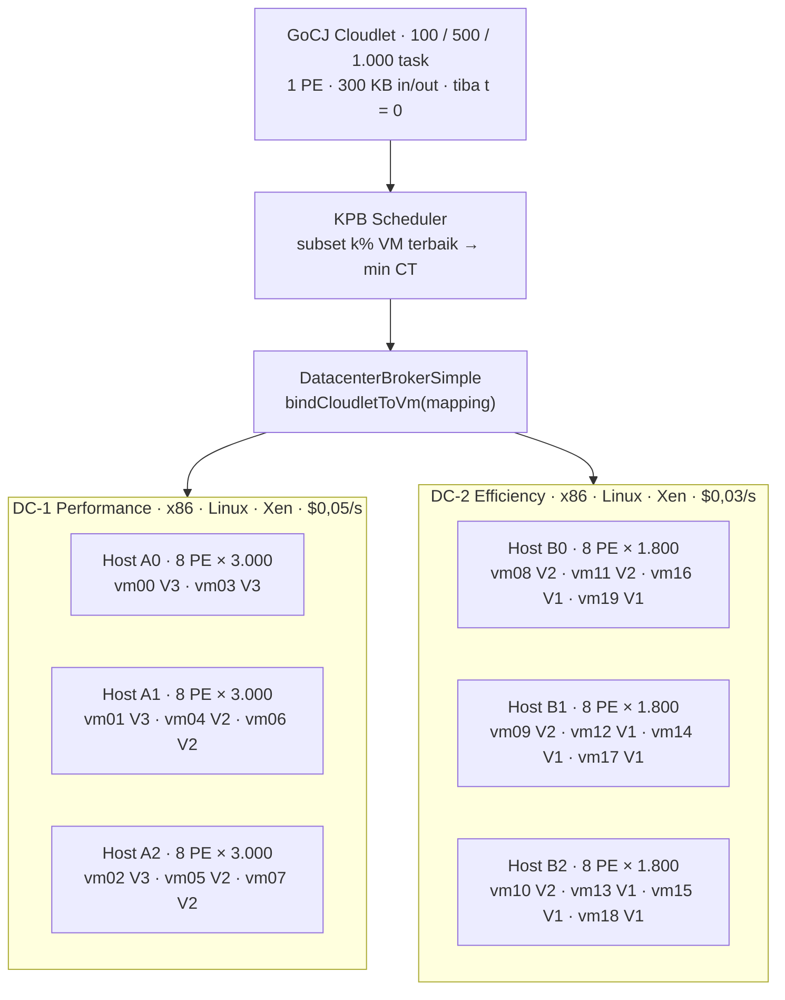
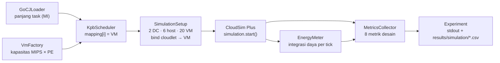
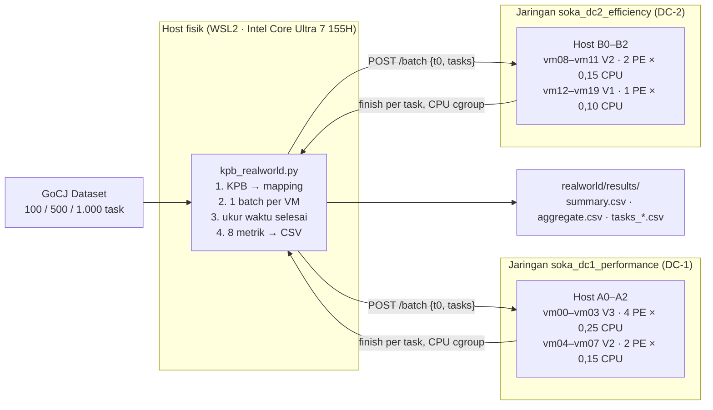

<h1 align="center">KPB Algorithm</h1>
<h2 align="center">Strategi Optimasi Komputasi Awan (SOKA) 2026</h2>
<h3 align="center"><em>Optimasi Penjadwalan Task Menggunakan Algoritma KPB (K-Percent Best)</em></h3>
<h4 align="center">Departemen Teknologi Informasi Institut Teknologi Sepuluh Nopember (ITS)</h4>


---

## Anggota Kelompok 5

| No. | Nama Mahasiswa | NRP | Jobdesk |
| :---: | :--- | :---: | :--- |
| 1 | Naila Cahyarani Idelia | 5027241063 | - |
| 2 | Mey Roslaina | 5027241004 | - |
| 3 | Diva Aulia Rosa | 5027241003 | - |
| 4 | Fika Arka Nuriah | 5027241071 | Architecture Design & Algorithm Simulation |

---

## Daftar Isi

- [1. Pendahuluan](#1-pendahuluan)
- [2. Cara Kerja Algoritma KPB](#2-cara-kerja-algoritma-kpb)
- [3. Arsitektur Datacenter](#3-arsitektur-datacenter)
- [4. Implementasi di Kode](#4-implementasi-di-kode)
- [5. Dataset Uji Coba](#5-dataset-uji-coba)
- [6. Hasil Simulasi (CloudSim Plus)](#6-hasil-simulasi-cloudsim-plus)
- [7. Implementasi Real-World](#7-implementasi-real-world)
  - [7.1 Arsitektur](#71-arsitektur)
  - [7.2 Pemetaan Simulasi → Real World](#72-pemetaan-simulasi--real-world)
  - [7.3 Cara Menjalankan](#73-cara-menjalankan)
  - [7.4 Hasil Ujicoba Real-World](#74-hasil-ujicoba-real-world)
  - [7.5 Analisis Real-World](#75-analisis-real-world)
  - [7.6 Batasan Real-World](#76-batasan-real-world)
  - [7.7 Kesimpulan Real-World](#77-kesimpulan-real-world)
- [8. Panduan Menjalankan Sim](#8-panduan-menjalankan-sim)
- [9. Struktur Direktori](#9-struktur-direktori)
- [10. Status dan Batasan](#10-status-dan-batasan)
- [11. Referensi](#11-referensi)

---

## 1. Pendahuluan

### 1.1 Latar Belakang

Lingkungan cloud terdiri atas VM dengan kapasitas yang berbeda-beda, sedangkan ukuran task pada dataset GoCJ berkisar antara 15.000 hingga 900.000 MI. Penjadwal harus memutuskan VM mana yang mengerjakan setiap task. Ada dua pendekatan greedy klasik untuk keputusan ini, dan keduanya punya kelemahan:

- **MET (Minimum Execution Time)** selalu memilih VM yang paling cepat mengeksekusi task. Waktu antrean diabaikan, sehingga semua task menumpuk di VM tercepat.
- **MCT (Minimum Completion Time)** memilih VM yang paling cepat *menyelesaikan* task, yaitu waktu antre ditambah waktu eksekusi. Akibatnya task besar bisa dikirim ke VM lambat yang kebetulan sedang kosong.

### 1.2 Solusi: Algoritma KPB

**KPB (K-Percent Best)** adalah heuristik *immediate mode* yang diperkenalkan oleh Maheswaran dkk. (1999). KPB berada di antara MET dan MCT:

> *"Untuk setiap task, batasi pilihan hanya pada k% VM yang paling cocok untuk task itu, lalu di antara kandidat tersebut pilih VM yang paling cepat menyelesaikannya."*

Parameter **k** mengatur perilaku KPB:

```
k = 100/m %  →  hanya 1 kandidat   →  KPB = MET
k = 100 %    →  semua VM kandidat  →  KPB = MCT
1/m < k < 1  →  kompromi: VM lambat tidak dipakai, antrean tetap diperhitungkan
```

Default yang dipakai di project ini adalah **k = 20%**, yaitu 4 dari 20 VM.

> **Perbedaan dengan LJFP.** LJFP mengurutkan task dari yang terpanjang, lalu menjalankan MCT pada **semua** VM. KPB **tidak** mengurutkan task (task diproses sesuai urutan kedatangan) dan hanya mempertimbangkan **subset k% VM terbaik** untuk setiap task.

---

## 2. Cara Kerja Algoritma KPB

### 2.1 Notasi

| Simbol | Arti |
|:---|:---|
| `L_i` | Panjang task *i* (MI) |
| `C_j` | Kapasitas VM *j* (MIPS × PE) |
| `ETC(i,j) = L_i / C_j` | Waktu eksekusi task *i* di VM *j* |
| `ready_j` | Waktu VM *j* selesai mengerjakan antreannya |
| `CT(i,j) = ready_j + ETC(i,j)` | Waktu selesai task *i* bila ditaruh di VM *j* |
| `m` | Jumlah VM (20) |
| `s = ⌈k% × m⌉` | Ukuran subset kandidat (k = 20% → s = 4) |

### 2.2 Langkah Algoritma


1. **Inisialisasi.** Waktu siap (`ready`) semua VM diset 0 karena semua task tiba bersamaan pada t = 0.
2. **Ambil task sesuai urutan kedatangan.** Task tidak diurutkan berdasarkan panjang.
3. **Bentuk subset k% terbaik.** Hitung waktu eksekusi task di setiap VM, urutkan, lalu ambil `s` VM dengan waktu eksekusi terkecil.
4. **Pilih completion time terkecil.** Di antara VM dalam subset, pilih VM dengan `ready + ETC` terkecil.
5. **Commit.** Catat assignment, lalu perbarui `ready` VM terpilih. Ulangi sampai semua task terjadwal.

### 2.3 Pseudocode

```text
KPB(tasks, vms, k):
    s ← max(1, ⌈k/100 × |vms|⌉)
    ready[j] ← 0 untuk setiap VM j
    for task i in tasks (urutan kedatangan):
        subset ← s VM dengan L_i / C_j terkecil
        best   ← argmin_{j ∈ subset} ( ready[j] + L_i / C_j )
        mapping[i] ← best
        ready[best] ← ready[best] + L_i / C_best
    return mapping
```

**Kompleksitas:** O(N · M log M) dengan N = jumlah task dan M = jumlah VM, karena VM diurutkan ulang untuk setiap task. Untuk N = 1.000 dan M = 20, prosesnya selesai dalam hitungan milidetik.

### 2.4 Contoh Perhitungan

Data contoh bawaan program memakai 5 task dan 20 VM dengan k = 20%, sehingga s = 4. Untuk setiap task, keempat VM V3 (10.000 MIPS) selalu menjadi kandidat terbaik.

| Task | Length (MI) | ETC di V3 | `ready` VM0..VM3 sebelum | CT kandidat | VM terpilih |
|:---:|---:|---:|:---:|:---:|:---:|
| 0 | 900.000 | 90 | 0, 0, 0, 0 | 90, 90, 90, 90 | VM0 |
| 1 | 600.000 | 60 | 90, 0, 0, 0 | 150, 60, 60, 60 | VM1 |
| 2 | 450.000 | 45 | 90, 60, 0, 0 | 135, 105, 45, 45 | VM2 |
| 3 | 300.000 | 30 | 90, 60, 45, 0 | 120, 90, 75, 30 | VM3 |
| 4 | 150.000 | 15 | 90, 60, 45, 30 | 105, 75, 60, **45** | VM3 |

Hasilnya `mapping = [0, 1, 2, 3, 3]`, sama dengan output `mvn -q exec:java`. Menurut rumus f1 desain, makespan-nya 90 s. Saat mapping ini dijalankan di CloudSim, makespan-nya **360,21 s**, karena cloudlet hanya memakai 1 PE (2.500 MIPS) dari 4 PE milik V3 (lihat bagian 6.2).

### 2.5 Perilaku KPB pada VM yang Konsisten

Pada konfigurasi project ini, VM yang lebih cepat selalu lebih cepat untuk **semua** task, karena `ETC = L / C`. Kondisi ini disebut *consistent ETC*. Akibatnya subset k% terbaik selalu berisi VM yang sama:

| k | Subset (s) | VM yang dipakai |
|:---:|:---:|:---|
| 20% | 4 | Hanya V3 (VM 0–3) |
| 50% | 10 | V3 + 6 VM V2 |
| 100% | 20 | Semua VM (setara MCT) |

Konsekuensinya, makin kecil k, makin sedikit VM yang terpakai, sehingga k menentukan seberapa terkonsolidasi beban kerja. Secara teori ini adalah tuas *trade-off* antara makespan dan energi. Namun hasil CloudSim (bagian 6.4) menunjukkan bahwa pada desain ini konsolidasi justru **memperburuk** energi, karena keenam host tetap menyala dan makespan bertambah panjang.

---

## 3. Arsitektur Datacenter

terdiri dua datacenter dengan karakter berbeda, satu berorientasi kinerja dan satu berorientasi efisiensi energi.

Arsitektur ini dibangun di **CloudSim Plus 6.6.1** sesuai Draft Desain Project bagian 2. Penempatan VM di bawah adalah hasil CloudSim yang sebenarnya (`results/simulation/placement.csv`).



### 3.1 Spesifikasi Datacenter

| Atribut | DC-1 (Performance) | DC-2 (Efficiency) |
|:---|:---:|:---:|
| Jumlah host | 3 (Tipe A) | 3 (Tipe B) |
| Arsitektur / OS / VMM | x86 / Linux / Xen | x86 / Linux / Xen |
| VmAllocationPolicy | VmAllocationPolicySimple + batasan C3–C6 | VmAllocationPolicySimple + batasan C3–C6 |
| VmScheduler | VmSchedulerTimeShared | VmSchedulerTimeShared |
| CloudletScheduler | CloudletSchedulerTimeShared | CloudletSchedulerTimeShared |
| Cost per second | $0,05 | $0,03 |
| Cost per RAM (GB) | $0,02 | $0,01 |
| Cost per storage (GB) | $0,001 | $0,0008 |
| Cost per bandwidth (Mbps) | $0,005 | $0,003 |

### 3.2 Spesifikasi Host

| Tipe Host | Jumlah | PE × MIPS | RAM | Bandwidth | P idle | P maks |
|:---|:---:|:---:|:---:|:---:|:---:|:---:|
| A Performance (DC-1) | 3 | 8 × 3.000 | 32 GB | 10 Gbps | 175 W | 250 W |
| B Efficiency (DC-2) | 3 | 8 × 1.800 | 32 GB | 5 Gbps | 72 W | 120 W |
| **Total** | **6** | **48 PE · 115.200 MIPS** | **192 GB** | — | — | — |

Model daya: `PowerModelHostSimple`, linear `P(u) = P_idle + (P_maks − P_idle) × u`.

### 3.3 Spesifikasi VM

| Tipe VM | Jumlah | PE × MIPS | Kapasitas (C_j) | RAM | Bandwidth | Indeks | Ditempatkan di |
|:---|:---:|:---:|:---:|:---:|:---:|:---:|:---|
| V3 Large | 4 | 4 × 2.500 | 10.000 MIPS | 8 GB | 1 Gbps | VM 0–3 | DC-1 (hanya muat di Tipe A) |
| V2 Medium | 8 | 2 × 1.500 | 3.000 MIPS | 4 GB | 1 Gbps | VM 4–11 | 4 di DC-1, 4 di DC-2 |
| V1 Small | 8 | 1 × 1.000 | 1.000 MIPS | 2 GB | 500 Mbps | VM 12–19 | DC-2 |
| **Total** | **20** | **40 PE** | **72.000 MIPS** | **80 GB** | — | — | — |

Penggunaan PE per host hasil CloudSim: A0, A1, A2 = 8/8 PE (DC-1 penuh), sedangkan B0, B1, B2 = 6/8, 5/8, 5/8 PE.

### 3.4 Batasan Keras (Desain bagian 4.3)

| Kode | Batasan | Cara dipenuhi di kode |
|:---:|:---|:---|
| C1 | Setiap task tepat di satu VM | `mapping[i]` berisi satu indeks VM; `SimulationSetup` mengecek tiap cloudlet berjalan di VM hasil KPB |
| C2 | Setiap VM tepat di satu host | Ditangani CloudSim; `SimulationSetup` memvalidasi 20/20 VM berhasil dibuat |
| C3 | Σ PE VM ≤ PE host | `ConstrainedPlacement`. `VmSchedulerTimeShared` bawaan hanya mengecek MIPS dan sempat menaruh 11 PE di host 8 PE |
| C4, C5 | RAM dan bandwidth host tidak terlampaui | `ConstrainedPlacement` + `Host.isSuitableForVm()` |
| C6 | MIPS per PE VM ≤ MIPS per PE host | `ConstrainedPlacement`: V3 (2.500) ditolak oleh host Tipe B (1.800) |
| C7 | Non-preemptive | Cloudlet tidak pernah dihentikan atau dipindah VM (tidak ada migrasi) |
| C8 | Variabel keputusan biner | Satu task → satu VM, satu VM → satu host |

---

## 4. Implementasi di Kode

### 4.1 Alur Program



KPB hanya melihat panjang task dan kapasitas VM (rumus f1 desain) untuk mengambil keputusan. Eksekusinya sepenuhnya dilakukan oleh CloudSim, termasuk pembagian CPU antar cloudlet (time-shared), batas 1 PE per cloudlet, RAM/BW, daya, dan biaya.

### 4.2 Daftar File

| File | Peran |
|:---|:---|
| [`KpbScheduler.java`](src/main/java/project/scheduler/KpbScheduler.java) | Algoritma KPB |
| [`Scheduler.java`](src/main/java/project/scheduler/Scheduler.java) | Antarmuka seragam: `int[] schedule(taskLength, vmCapacity)` |
| [`Experiment.java`](src/main/java/project/Experiment.java) | Entry point: dataset → KPB → CloudSim → metrik → CSV |
| [`GoCJLoader.java`](src/main/java/project/data/GoCJLoader.java) | Membaca file GoCJ (satu nilai MI per baris) |
| [`DatacenterFactory.java`](src/main/java/project/setup/DatacenterFactory.java) | 2 DC, 6 host, model daya, biaya, scheduling interval 1 s |
| [`VmFactory.java`](src/main/java/project/setup/VmFactory.java) | 20 VM (V3/V2/V1) dengan `CloudletSchedulerTimeShared` |
| [`ConstrainedPlacement.java`](src/main/java/project/setup/ConstrainedPlacement.java) | Pemilihan host yang menegakkan C3–C6, dan rencana VM → DC |
| [`SimulationSetup.java`](src/main/java/project/setup/SimulationSetup.java) | Broker, cloudlet (300 KB, UtilizationModel), binding, validasi |
| [`CloudSimAdapter.java`](src/main/java/project/setup/CloudSimAdapter.java) | Mengubah VM CloudSim menjadi array kapasitas untuk scheduler |
| [`EnergyMeter.java`](src/main/java/project/metrics/EnergyMeter.java) | Integrasi `P(u)` semua host dari 0 sampai makespan |
| [`MetricsCollector.java`](src/main/java/project/metrics/MetricsCollector.java) | Menghitung 8 metrik desain dari hasil CloudSim |
| [`EtcMatrix.java`](src/main/java/project/model/EtcMatrix.java), [`FitnessEvaluator.java`](src/main/java/project/model/FitnessEvaluator.java) | Model analitik f1 (pembanding) |

### 4.3 Pemetaan Langkah KPB ke Kode

| Langkah | Kode di `KpbScheduler.schedule()` |
|:---|:---|
| 1. Task diproses sesuai urutan kedatangan | `for (int task = 0; task < taskLength.length; task++)` |
| 2. Ranking VM berdasarkan ETC | `rankByExecutionTime(taskLength[task], vmCapacity)` |
| 3. Ambil subset k% | `for (int c = 0; c < subsetSize; c++)` dengan `subsetSize = ⌈k% × m⌉` |
| 4. Pilih min completion time | `finish = readyTime[vm] + taskLength[task] / vmCapacity[vm]` |
| 5. Commit dan update ready time | `mapping[task] = selectedVm; readyTime[selectedVm] = bestFinish;` |

### 4.4 Catatan Implementasi CloudSim

Tiga jebakan CloudSim Plus 6.6.1 yang ditemukan dan ditangani. Ketiganya membuat hasil salah **tanpa pesan error**:

1. **`bindCloudletToVm` diam-diam gagal** bila dipanggil sebelum `submitCloudletList` (mengembalikan `false`). Broker lalu membagi task secara round-robin, sehingga hasil "KPB" sebenarnya hasil round-robin. Binding kini dilakukan setelah submit, dan setiap hasilnya dicek.
2. **VmSchedulerTimeShared tidak membatasi jumlah PE**, hanya MIPS. Tanpa `ConstrainedPlacement`, ke-20 VM dimasukkan ke DC-1 (host berisi 11 PE dari 8) dan DC-2 kosong, sehingga melanggar C3.
3. **VM yang di-retry ke DC-2 tidak pernah menerima cloudlet**: 43 dari 100 cloudlet tertinggal berstatus QUEUED. Penempatan VM → DC kini direncanakan di awal dengan aturan yang sama, sehingga tidak ada retry.

Setiap run memvalidasi: 20/20 VM dibuat, setiap cloudlet berjalan di VM hasil KPB, dan semua cloudlet selesai.

---

## 5. Dataset Uji Coba

| Aspek | Keterangan |
|:---|:---|
| Nama | GoCJ (Google Cloud Jobs) Dataset |
| Sumber | Mendeley Data, diturunkan dari jejak beban kerja Google cluster |
| Format | Teks, satu panjang task (MI) per baris |
| Rentang | 15.000 – 900.000 MI |
| File | `GoCJ_Dataset_100.txt`, `GoCJ_Dataset_500.txt`, `GoCJ_Dataset_1000.txt` |

| Skenario | Jumlah task | Tujuan |
|:---:|:---:|:---|
| S1 | 100 | Verifikasi kebenaran implementasi |
| S2 | 500 | Beban normal (skenario acuan utama) |
| S3 | 1.000 | Uji skalabilitas |

Pemetaan ke cloudlet (Desain bagian 1.3):

| Parameter cloudlet | Nilai |
|:---|:---|
| `length` | Dari dataset GoCJ (MI) |
| `numberOfPes` | 1 |
| `fileSize` / `outputSize` | 300 KB / 300 KB |
| `utilizationModelCpu` | `UtilizationModelFull` (100%) |
| `utilizationModelRam` / `Bw` | `UtilizationModelDynamic` 20% |
| Waktu kedatangan | Serentak pada t = 0 (offline batch) |

---

## 6. Hasil Simulasi (CloudSim Plus)

Semua angka di bagian ini berasal dari **simulasi CloudSim Plus penuh**. Simulasi bersifat deterministik: dua kali run menghasilkan angka identik, sehingga cukup dijalankan 1× per konfigurasi (10 run akan memberi std = 0). Data lengkap ada di [`results/simulation/summary.csv`](results/simulation/summary.csv).

### 6.1 Delapan Metrik Desain

| Skenario | k | Makespan (s) | Energi (kWh) | Avg response (s) | Utilisasi | DI | Throughput (task/s) | Biaya (USD) | Waktu penjadwalan |
|:---:|:---:|---:|---:|---:|---:|---:|---:|---:|---:|
| S1 (100) | 20% | 1.327,25 | 0,3025 | 577,52 | 14,49% | 6,902 | 0,0753 | 1.659,18 | 0,34 ms |
| S1 (100) | 50% | 515,16 | 0,1224 | 228,82 | 34,54% | 2,895 | 0,1941 | 684,67 | 0,22 ms |
| S1 (100) | 100% | **483,76** | **0,1130** | **151,31** | **42,09%** | **1,835** | **0,2067** | **646,99** | 0,46 ms |
| S2 (500) | 20% | 21.269,22 | 5,0800 | 13.401,81 | 19,09% | 5,238 | 0,0235 | 25.589,54 | 0,57 ms |
| S2 (500) | 50% | 6.854,69 | 1,7243 | 4.022,77 | 43,28% | 2,311 | 0,0729 | 8.292,11 | 1,33 ms |
| S2 (500) | 100% | **4.147,56** | **1,0481** | **1.924,67** | **62,50%** | **0,949** | **0,1206** | **5.043,55** | 2,11 ms |
| S3 (1.000) | 20% | 87.658,41 | 20,7890 | 52.584,63 | 18,07% | 5,533 | 0,0114 | 105.256,57 | 0,91 ms |
| S3 (1.000) | 50% | 29.110,06 | 7,1889 | 15.464,50 | 38,82% | 2,576 | 0,0344 | 34.998,56 | 1,63 ms |
| S3 (1.000) | 100% | **15.060,48** | **3,8211** | **7.031,87** | **63,31%** | **0,976** | **0,0664** | **18.139,06** | 2,00 ms |

Keterangan: DI dihitung atas 20 VM sesuai definisi desain; biaya = CPU + RAM + bandwidth (`VmCost`); energi mencakup 6 host dari t = 0 sampai makespan, termasuk daya idle.

### 6.2 CloudSim vs Model Analitik (Rumus f1 Desain)

| Skenario | k | Analitik f1 (s) | CloudSim, RAM/BW 0% (s) | CloudSim, RAM/BW 20% sesuai desain (s) |
|:---:|:---:|---:|---:|---:|
| S1 (100) | 20% | 362,45 | 513,89 | 1.327,25 |
| S1 (100) | 50% | 270,95 | 373,05 | 515,16 |
| S1 (100) | 100% | 230,90 | 423,30 | 483,76 |
| S2 (500) | 20% | 1.630,75 | 1.706,46 | 21.269,22 |
| S2 (500) | 50% | 1.134,70 | 1.216,04 | 6.854,69 |
| S2 (500) | 100% | 925,40 | 1.009,70 | 4.147,56 |
| S3 (1.000) | 20% | 3.278,25 | 3.421,73 | 87.658,41 |
| S3 (1.000) | 50% | 2.288,00 | 2.469,58 | 29.110,06 |
| S3 (1.000) | 100% | 1.866,35 | 1.968,56 | 15.060,48 |

Kolom "RAM/BW 0%" adalah uji sensitivitas: konfigurasi sama, hanya `UtilizationModelDynamic` RAM/BW diset 0.

Contoh 5 task (bagian 2.4) memperlihatkan perbedaan paling dasar. Rumus f1 memberi makespan 90 s, sedangkan CloudSim memberi **360,21 s**. Cloudlet hanya punya 1 PE, sehingga task 900.000 MI di V3 berjalan di 2.500 MIPS (satu PE), bukan 10.000 MIPS (empat PE).

### 6.3 Log Eksekusi

```text
$ mvn -q exec:java -Dexec.args="src/main/resources/dataset/GoCJ_Dataset_500.txt 50"
placement=vm0:V3@DC1/H0 vm1:V3@DC1/H1 vm2:V3@DC1/H2 vm3:V3@DC1/H0 vm4:V2@DC1/H1 ... vm19:V1@DC2/H0
scheduler=KPB(k=50.0%)
tasks=500, vmsCreated=20/20, cloudletsFinished=500/500
makespan=6854.690 s (analitik 1134.700 s), energy=1.7243 kWh, avgResponse=4022.775 s
utilization=43.28%, DI=2.3106 (VM terpakai 0.3211), throughput=0.0729 task/s
cost=$8292.11, schedulingTime=1.327 ms
mapping=[0, 1, 2, 3, 0, 1, 2, 2, 3, 1, 0, 1, 4, 3, 5, 6, 7, 2, 8, 9, ...]
vmFinish=[6697.69, 6854.69, 6849.69, 6108.69, 5716.69, 4949.69, 5059.69, 5728.69, 5287.54, 6079.54, 0.0 × 10]
```

Log semua run ada di `results/simulation/log_<dataset>_k<K>.txt`.

### 6.4 Analisis Simulasi

1. **k = 100% terbaik di semua metrik dan skenario.** Makespan, energi, response time, biaya, dan DI semuanya paling kecil pada k = 100%. Dibanding k = 20%, makespan S3 turun 83% (87.658 → 15.060 s).
2. **Konsolidasi tidak menghemat energi di desain ini.** Pada k = 20% hanya 4 VM V3 yang dipakai, tetapi keenam host tetap menyala (daya idle 741 W total), dan makespan jauh lebih lama. Akibatnya energi S3 justru 5,4× lebih besar (20,79 vs 3,82 kWh). Daya idle mendominasi: konsolidasi baru menguntungkan bila host yang menganggur dimatikan, yang tidak dimodelkan di desain (tanpa migrasi atau konsolidasi dinamis, bagian 6 desain).
3. **Kontensi RAM/BW adalah penyebab utama makespan membengkak.** Dengan `CloudletSchedulerTimeShared`, semua cloudlet di satu VM aktif bersamaan, dan masing-masing meminta 20% RAM dan BW VM. Mulai cloudlet ke-6 RAM VM habis, lalu CloudSim memakai virtual memory dan memperlambat eksekusi. Pada S3 k = 20% (~250 cloudlet per VM V3), makespan menjadi 87.658 s, padahal hanya 3.422 s bila RAM/BW tidak membebani (tabel 6.2). Jadi pada desain ini, menumpuk task di sedikit VM sangat merugikan.
4. **Rumus f1 desain terlalu optimis.** Rumus menganggap 1 task bisa memakai seluruh PE VM. Tanpa kontensi RAM/BW pun CloudSim 4–83% lebih lambat dari f1, karena cloudlet 1 PE tidak bisa memakai PE lain. Selisih terbesar ada di S1, karena task besar menjadi penentu makespan.
5. **Waktu penjadwalan sangat kecil.** KPB menjadwalkan 1.000 task dalam ~2 ms (metrik 8), sehingga overhead algoritma dapat diabaikan.

---

## 7. Implementasi Real-World

Di simulasi, CloudSim *menghitung* eksekusi cloudlet. Di real world, task GoCJ yang sama **benar-benar dieksekusi** di 20 container Docker, lalu makespan diukur dengan jam dinding (wall-clock). Infrastruktur container mengikuti Desain bagian 2 dan penempatan VM hasil CloudSim.

### 7.1 Arsitektur



| Komponen | File | Peran |
|:---|:---|:---|
| 20 "VM" | [`realworld/docker-compose.yml`](realworld/docker-compose.yml) | Container `python:3.12-slim`. Batas CPU, jumlah PE, RAM, jaringan DC, dan label host sesuai desain |
| Worker | [`realworld/worker/worker.py`](realworld/worker/worker.py) | Server HTTP di tiap container dengan `PES` proses PE yang meniru `CloudletSchedulerTimeShared` |
| Scheduler | [`realworld/kpb_realworld.py`](realworld/kpb_realworld.py) | Port KPB dari `KpbScheduler.java`, eksekusi, 8 metrik desain, repetisi, ekspor CSV |

### 7.2 Pemetaan Simulasi → Real World

| Konsep desain / CloudSim | Real world |
|:---|:---|
| Skala MIPS | 1,0 CPU container = 10.000 MIPS |
| VM V3 (4 PE × 2.500) | Container 1,0 CPU dengan 4 proses PE, masing-masing ≤ 0,25 CPU |
| VM V2 (2 PE × 1.500) | Container 0,3 CPU dengan 2 proses PE, masing-masing ≤ 0,15 CPU |
| VM V1 (1 PE × 1.000) | Container 0,1 CPU dengan 1 proses PE |
| RAM VM (8 / 4 / 2 GB) | `mem_limit` container 8g / 4g / 2g |
| DC-1 / DC-2 | Jaringan Docker `soka_dc1_performance` / `soka_dc2_efficiency` |
| Host & penempatan VM | Label `soka.host`, sama dengan `results/simulation/placement.csv` (dicek otomatis setiap run) |
| Cloudlet 1 PE, `L_i` MI | `L_i × 14` iterasi CPU, dikerjakan oleh **satu** PE pada satu waktu |
| `CloudletSchedulerTimeShared` | Semua task di satu VM aktif bersamaan dan bergiliran per *chunk* (50.000 iterasi) di PE yang tersedia |
| Makespan, response time | Waktu selesai task (jam *monotonic* bersama host–container) dihitung dari t0 batch |
| Energi (`PowerModelHostSimple`) | Model daya desain diterapkan pada CPU yang **diukur** dari cgroup tiap container, dikelompokkan per host |
| Biaya (`VmCost`) | Rumus yang sama dengan CloudSim, dengan umur VM = makespan nyata |

Tiga hal yang membuat eksekusinya nyata, bukan sekadar meniru durasi:

1. **Beban berbasis jumlah kerja.** Worker tidak diberi tahu berapa lama harus berjalan. Jumlah iterasi task sama di container mana pun, dan perbedaan waktu berasal dari batas CPU kernel (CFS, `cpu_quota` dengan periode 10 ms) serta batas per PE.
2. **Batas 1 PE per task.** Seperti cloudlet CloudSim, satu task tidak bisa memakai lebih dari satu PE. Task 900.000 MI di V3 tetap berjalan di ~2.500 MIPS walaupun V3 sedang kosong.
3. **Mapping identik dengan simulasi.** `kpb_schedule()` di Python menghasilkan mapping yang sama persis dengan `KpbScheduler.java` (diverifikasi untuk S1 k=20%, S2 k=50%, S3 k=100%, dan S3 k=20%).

### 7.3 Cara Menjalankan

#### Langkah 1: Cek prasyarat

| Software | Cek | Keterangan |
|:---|:---|:---|
| Docker Engine | `docker version` | Bagian **Server** harus muncul. Kalau tidak, Docker daemon belum jalan |
| Docker Compose v2 | `docker compose version` | Sudah termasuk di Docker Desktop / Docker Engine terbaru |
| Python 3.8+ | `python3 --version` | Hanya standard library, **tidak perlu** `pip install` |

Pengguna WSL: buka Docker Desktop di Windows dulu (pastikan *WSL integration* aktif), atau jalankan `sudo service docker start` bila Docker diinstal langsung di WSL.

#### Langkah 2: (Disarankan) jalankan simulasi dulu

```bash
cd soka-a-5
mvn -q exec:java -Dexec.args="src/main/resources/dataset/GoCJ_Dataset_100.txt"
```

Langkah ini membuat `results/simulation/placement.csv`, yang dipakai real world untuk memverifikasi bahwa penempatan VM sama dengan CloudSim.

#### Langkah 3: Masuk ke folder `realworld/` dan nyalakan 20 container

```bash
cd realworld
docker compose up -d
```

Saat pertama kali, Docker mengunduh image `python:3.12-slim` (±50 MB). Bila sebelumnya sudah memakai versi lama compose ini, jalankan `docker compose up -d --force-recreate`.

#### Langkah 4: Pastikan semua container siap

```bash
docker ps --filter name=kpb_vm --format '{{.Names}}  {{.Status}}'   # harus 20 baris "Up"
curl http://127.0.0.1:9100/health
# {"vm": "vm00", "pes": 4, "pe_share": 0.25, "status": "ok"}
curl http://127.0.0.1:9119/health
# {"vm": "vm19", "pes": 1, "pe_share": 0.1, "status": "ok"}
```

#### Langkah 5: Uji coba cepat (±15 detik)

```bash
python3 kpb_realworld.py --limit 20 --repeat 1 --out results_demo
```

Selama berjalan, terminal menampilkan **log broker real-time**. Setiap baris muncul saat cloudlet benar-benar selesai di container-nya. Angka di kiri adalah detik sejak batch dikirim:

```text
scheduler=KPB(k=20.0%) realworld, placement cocok dengan CloudSim
dataset=../src/main/resources/dataset/GoCJ_Dataset_100.txt tasks=20 subset=4 repeat=1 itersPerMI=14 scale=0.0328
[run 1/1] menjalankan task di container... (prediksi analitik ±2.9 s)
     0.00: Broker: Mengirim Cloudlet #0 (127000 MI) ke vm00 (V3) di DC-1/Host A0
     0.00: Broker: Mengirim Cloudlet #1 (83000 MI) ke vm01 (V3) di DC-1/Host A1
     ...
     0.31: Broker: Cloudlet #5 selesai di vm03 (V3) di DC-1/Host A0, diterima broker
     0.31: Broker: Jumlah cloudlet selesai: 1/20
     0.49: Broker: Cloudlet #9 selesai di vm02 (V3) di DC-1/Host A2, diterima broker
     0.49: Broker: Jumlah cloudlet selesai: 2/20
     ...
     1.27: Broker: vm00 (V3) selesai: 4 cloudlet, CPU terpakai 1.11 s
     7.64: Broker: Cloudlet #11 selesai di vm02 (V3) di DC-1/Host A2, diterima broker
     7.64: Broker: Jumlah cloudlet selesai: 20/20
     7.65: Broker: vm02 (V3) selesai: 4 cloudlet, CPU terpakai 2.44 s
     7.64: Broker: Semua cloudlet selesai (20/20). Finishing...
  makespan=7.641s, energy=0.001620 kWh, ..., vmsUsed=4/20
```

| Baris log | Artinya |
|:---|:---|
| `Mengirim Cloudlet #i (L MI) ke vmXX (tipe) di DC-d/Host h` | Keputusan KPB: task i dikirim ke VM pilihan KPB, lengkap dengan DC dan host-nya |
| `Cloudlet #i selesai di vmXX ..., diterima broker` | Task i selesai dieksekusi di container dan hasilnya kembali ke runner |
| `Jumlah cloudlet selesai: x/N` | Progres keseluruhan |
| `vmXX (tipe) selesai: n cloudlet, CPU terpakai c s` | Semua task di VM itu selesai; CPU diukur dari cgroup container |
| `Semua cloudlet selesai (N/N). Finishing...` | Run selesai, lalu metrik dihitung |

Waktu selesai diukur di dalam container, jadi pencetakan log tidak memengaruhi metrik. Log bisa dimatikan dengan `--quiet`.

Kalau muncul `placement cocok dengan CloudSim`, `Semua cloudlet selesai`, dan baris `makespan=...`, setup sudah benar. Folder `results_demo/` boleh dihapus setelahnya.

#### Langkah 6: Jalankan skenario

Format: `python3 kpb_realworld.py --dataset <file GoCJ> --k <persen> --repeat <N>`

```bash
# S1, 1 repetisi (±15 detik)
python3 kpb_realworld.py --dataset ../src/main/resources/dataset/GoCJ_Dataset_100.txt --k 20 --repeat 1

# S2: 500 task, k = 50%, 3 repetisi (±3 menit)
python3 kpb_realworld.py --dataset ../src/main/resources/dataset/GoCJ_Dataset_500.txt --k 50

# S3: 1.000 task, k = 100%, 3 repetisi (±6–7 menit)
python3 kpb_realworld.py --dataset ../src/main/resources/dataset/GoCJ_Dataset_1000.txt --k 100
```

Seluruh 9 kombinasi × 3 repetisi, sama seperti tabel 7.4 (±30 menit). `--quiet` dipakai supaya log tidak berisi ribuan baris per cloudlet:

```bash
rm -rf results && mkdir results    # opsional: summary.csv dan aggregate.csv bersifat append

for n in 100 500 1000; do for k in 20 50 100; do
  echo "== GoCJ $n task, k = $k% =="
  python3 kpb_realworld.py --dataset ../src/main/resources/dataset/GoCJ_Dataset_$n.txt --k $k --repeat 3 --quiet \
    | tee results/log_GoCJ_Dataset_${n}_k$k.txt
done; done
```

Selama berjalan, penggunaan CPU per container bisa dipantau dari terminal lain (tekan `Ctrl+C` untuk keluar):

```bash
# dari folder realworld/
docker compose stats

# atau dari folder mana pun
docker stats $(docker ps -q --filter name=kpb_vm)
```

Saat semua VM sibuk, kolom `CPU %` akan menunjukkan sekitar 100% untuk V3 (vm00–vm03), ~30% untuk V2 (vm04–vm11), dan ~10% untuk V1 (vm12–vm19), sesuai batas CPU masing-masing.

#### Langkah 7: Lihat hasil

```bash
column -s, -t results/aggregate.csv | less -S    # mean ± std per konfigurasi
column -s, -t results/summary.csv | less -S      # satu baris per run
```

| File | Isi |
|:---|:---|
| `results/aggregate.csv` | Satu baris per konfigurasi: mean dan std 8 metrik |
| `results/summary.csv` | Satu baris per run: 8 metrik, skala, prediksi analitik |
| `results/tasks_<dataset>_n<N>_k<K>_run<R>.csv` | Per task: VM, tipe, DC, host, waktu selesai |
| `results/log_<dataset>_k<K>.txt` | Salinan output terminal (bila memakai loop di atas) |

#### Langkah 8: Bandingkan mapping dengan simulasi

`kpb_schedule()` di Python memakai logika yang sama dengan `KpbScheduler.java`. Untuk membuktikannya, bandingkan mapping Python dengan VM tempat setiap cloudlet berjalan di CloudSim (`results/simulation/cloudlets_<dataset>_k<K>.csv`, hasil bagian 8):

```bash
for k in 20 50 100; do python3 -c "
import csv, kpb_realworld as r
L = r.load_gocj('../src/main/resources/dataset/GoCJ_Dataset_100.txt')
py = r.kpb_schedule(L, [v['capacity'] for v in r.VMS], $k)
java = [int(row['vm']) for row in csv.DictReader(open('../results/simulation/cloudlets_GoCJ_Dataset_100_k$k.csv'))]
print('k=$k%:', 'IDENTIK' if py == java else 'BEDA', '-', sum(a == b for a, b in zip(py, java)), '/', len(java), 'task sama')
"; done
```

```text
k=20%: IDENTIK - 100 / 100 task sama
k=50%: IDENTIK - 100 / 100 task sama
k=100%: IDENTIK - 100 / 100 task sama
```

#### Langkah 9: Matikan container

```bash
docker compose down
```

#### Troubleshooting

| Masalah | Penyebab / solusi |
|:---|:---|
| `[ERROR] vm00 (http://127.0.0.1:9100) tidak merespons` | Container belum jalan. Lakukan langkah 3–4, tunggu beberapa detik, lalu ulangi |
| `[ERROR] vm00 masih memakai worker versi lama (tanpa log real-time)` | Container belum memuat `worker.py` terbaru. Jalankan `docker compose restart` |
| `[ERROR] vm00 punya None PE, seharusnya 4` | Container masih versi lama. Jalankan `docker compose up -d --force-recreate` |
| `[ERROR] Penempatan vmXX beda dengan CloudSim` | Konfigurasi simulasi berubah. Samakan `PLACEMENT` di `kpb_realworld.py` dengan `results/simulation/placement.csv` |
| `Cannot connect to the Docker daemon` | Docker belum dinyalakan (lihat langkah 1) |
| `port is already allocated` (9100–9119) | Port dipakai program lain. Matikan program itu, atau ganti port di `docker-compose.yml` dan `kpb_realworld.py` |
| Makespan jauh lebih lama dari tabel 7.4 | Laptop sedang sibuk, panas, atau dalam mode hemat daya. Tutup aplikasi berat, colokkan charger, lalu ulangi |

#### Argumen `kpb_realworld.py`

| Argumen | Default | Arti |
|:---|:---:|:---|
| `--dataset` | GoCJ 100 | File dataset GoCJ |
| `--k` | 20 | Persen VM kandidat KPB |
| `--repeat` | 3 | Jumlah repetisi (mean ± std dihitung otomatis) |
| `--iters-per-mi` | 14 | Iterasi CPU per MI (beban per task) |
| `--limit` | 0 (semua) | Hanya pakai N task pertama |
| `--out` | `results` | Folder output CSV |
| `--placement` | `../results/simulation/placement.csv` | File penempatan CloudSim untuk verifikasi |
| `--quiet` | mati | Sembunyikan log broker real-time per cloudlet |

Contoh output dengan `--quiet` (S2, k = 50%):

```text
scheduler=KPB(k=50.0%) realworld, placement cocok dengan CloudSim
dataset=../src/main/resources/dataset/GoCJ_Dataset_500.txt tasks=500 subset=10 repeat=3 itersPerMI=14 scale=0.0247
[run 1/3] menjalankan task di container... (prediksi analitik ±28.1 s)
  makespan=59.462s, energy=0.014849 kWh, avgResponse=36.502s, utilization=44.64%, DI=2.2401 (VM terpakai 0.1661), throughput=8.409 task/s, cost=$136.63, schedulingTime=1.464 ms, vmsUsed=10/20
[run 2/3] ...
[run 3/3] ...
rata-rata ± std dari 3 run:
  makespan_s              57.0923 ± 2.0882
  energy_kwh               0.0143 ± 0.0005
  avg_response_s          35.6022 ± 0.9000
  utilization_pct         45.5596 ± 0.7990
  di_all_vm                2.1954 ± 0.0389
  di_used_vm               0.1423 ± 0.0219
  throughput_task_s        8.7654 ± 0.3150
  cost_usd               133.7908 ± 2.5059
  scheduling_ms            1.9813 ± 0.4500
```

- `scale`: 1 detik simulasi = `scale` detik nyata, dari kalibrasi 1 PE V3 sebelum run.
- `prediksi analitik`: makespan rumus f1 × `scale`.
- `energy`: model daya desain diterapkan pada CPU terukur, untuk 6 host selama makespan nyata.
- `cost`: rumus `VmCost` CloudSim dengan umur VM = makespan nyata.

### 7.4 Hasil Ujicoba Real-World

**Environment:** Docker 29.8 di WSL2, Intel Core Ultra 7 155H (6 P-core + 8 E-core + 2 LP-E core, 22 thread), 8 GB RAM. Nilai berikut adalah hasil run final (1 run per konfigurasi, dijalankan berurutan dalam satu sesi). Semua task selesai tanpa kegagalan, dan penempatan VM selalu cocok dengan CloudSim. Data mentah ada di [`realworld/results/aggregate.csv`](realworld/results/aggregate.csv) (baris dengan `runs=1`, 2026-10-03).

> Pengujian awal memakai 3 repetisi per konfigurasi untuk mendapat std; hasilnya stabil di S1–S2 tapi tidak stabil di S3 (std makespan sampai ±23,5 s) akibat thermal throttling laptop. Tabel di bawah ini adalah run susulan yang paling valid, dilakukan setelah itu dalam kondisi laptop lebih terkontrol. Data 3 repetisi awal tetap ada di `aggregate.csv` (baris `runs=3`) dan dibahas di bagian 7.7 (Anomali).

| Skenario | k | Makespan (s) | Energi (kWh) | Avg response (s) | Utilisasi | DI (semua VM / terpakai) | Throughput (task/s) | Biaya (USD) | Waktu penjadwalan |
|:---:|:---:|---:|---:|---:|---:|:---:|---:|---:|---:|
| S1 (100) | 20% | 15,02 | 0,00344 | 5,77 | 18,8% | 5,31 / 0,17 | 6,66 | 83,31 | 0,61 ms |
| S1 (100) | 50% | **12,25** | **0,00287** | 5,00 | 33,7% | 2,97 / 0,80 | 8,16 | **79,98** | 0,63 ms |
| S1 (100) | 100% | 13,27 | 0,00310 | **4,31** | 44,1% | 1,67 / 1,67 | 7,54 | 81,20 | 0,61 ms |
| S2 (500) | 20% | 53,90 | 0,01276 | 26,53 | 18,6% | 5,38 / 0,11 | 9,28 | 129,96 | 2,58 ms |
| S2 (500) | 50% | 50,26 | 0,01262 | 29,86 | 45,1% | 2,22 / 0,16 | 9,95 | 125,59 | 1,70 ms |
| S2 (500) | 100% | **42,09** | **0,01097** | 26,45 | 86,0% | 0,27 / 0,27 | 11,88 | **115,79** | 2,89 ms |
| S3 (1.000) | 20% | 106,90 | 0,02556 | 58,98 | 19,3% | 5,19 / 0,06 | 9,35 | 193,55 | 5,50 ms |
| S3 (1.000) | 50% | 96,61 | 0,02449 | 61,47 | 47,2% | 2,12 / 0,08 | 10,35 | 181,21 | 7,23 ms |
| S3 (1.000) | 100% | **80,74** | **0,02139** | **55,26** | 91,8% | 0,13 / 0,13 | **12,38** | **162,17** | 7,10 ms |

DI dihitung dua cara: atas seluruh 20 VM (sesuai definisi desain, dipakai di bagian 6.1) dan hanya atas VM yang terpakai (dalam kurung di output program). Pada k = 100%, keduanya sama karena semua VM terpakai. Energi dan biaya di real world dihitung untuk durasi nyata (detik), jauh lebih kecil daripada simulasi (berskala ±40× lebih lama) — yang bisa dibandingkan adalah **trennya**, bukan angka mutlaknya.

**Real world vs CloudSim.** Prediksi = makespan CloudSim tanpa kontensi RAM/BW (tabel 6.2) × `scale`, karena real world tidak meniru RAM/BW 20% per task (lihat 7.6).

| Skenario | k | Prediksi dari CloudSim (s) | Nyata (s) | Nyata / prediksi | Proses PE aktif |
|:---:|:---:|---:|---:|:---:|:---:|
| S1 (100) | 20% | 11,8 | 15,02 | 1,27× | 16 |
| S1 (100) | 50% | 9,5 | 12,25 | 1,29× | 28 |
| S1 (100) | 100% | 7,6 | 13,27 | 1,74× | 40 |
| S2 (500) | 20% | 54,5 | 53,90 | 0,99× | 16 |
| S2 (500) | 50% | 35,1 | 50,26 | 1,43× | 28 |
| S2 (500) | 100% | 28,2 | 42,09 | 1,49× | 40 |
| S3 (1.000) | 20% | 105,8 | 106,90 | 1,01× | 16 |
| S3 (1.000) | 50% | 77,3 | 96,61 | 1,25× | 28 |
| S3 (1.000) | 100% | 62,2 | 80,74 | 1,30× | 40 |

### 7.5 Analisis Real-World

1. **Perilaku KPB terkonfirmasi.** Jumlah VM terpakai selalu sama dengan `s = ⌈k% × 20⌉` (utilisasi ~19% / ~45% / ~90% pada S2–S3), dan DI atas VM terpakai kecil untuk k = 20–50% (0,06–0,80). Penempatan VM, batas PE, dan time-sharing berjalan seperti di CloudSim.
2. **k = 100% paling cepat di S2 dan S3, sejalan dengan simulasi (bagian 6.1 dan 6.4).** Di S2, 21,9% lebih cepat dari k = 20% (42,09 s vs 53,90 s); di S3, 24,5% lebih cepat (80,74 s vs 106,90 s). Energi, biaya, dan throughput juga paling baik di k = 100% pada kedua skenario itu.
3. **Pada S1, k = 50% justru sedikit lebih cepat dari k = 100%** (12,25 s vs 13,27 s) — kebalikan dari simulasi, yang tetap menunjukkan k = 100% tercepat (483,76 s). Penyebabnya adalah efek penempatan pada task raksasa, bukan k = 50% yang lebih baik secara umum (lihat 7.7, bagian Anomali).
4. **Rasio nyata/prediksi naik seiring makin banyak proses PE aktif** (16 → 28 → 40), dari ±1,0–1,3× menjadi ±1,3–1,7×. Laptop memakai CPU hybrid; makin banyak proses aktif, makin banyak yang terpaksa berjalan di E-core dan LP-E core yang lebih lambat. Overhead ini **tidak sampai membalik urutan** pada run final, berbeda dengan pengujian 3-repetisi awal di S3 yang sempat kena thermal throttling (lihat 7.7, bagian Anomali) — bukti bahwa overhead CPU hybrid konsisten ada, tapi besarnya bergantung kondisi laptop saat itu.
5. **Biaya dan energi mengikuti makespan.** Karena semua VM dan host dihitung menyala selama makespan, konfigurasi yang paling cepat selalu paling hemat energi dan biaya. Kesimpulannya sama dengan simulasi (bagian 6.4).
6. **Waktu penjadwalan tetap kecil.** KPB di Python menjadwalkan 1.000 task dalam ~5–7 ms.

### 7.6 Batasan Real-World

- **Container adalah proksi VM, dan host hanyalah label.** Ke-20 container berbagi satu CPU laptop, sehingga ada interferensi (P-core vs E-core, thermal) yang tidak ada di CloudSim.
- **RAM/BW 20% per task tidak ditiru.** Meniru 20% RAM VM per task (V3: 1,6 GB × ratusan task bersamaan) mustahil di laptop 8 GB. Karena itu, pembanding yang adil adalah CloudSim tanpa kontensi RAM/BW (tabel 6.2), bukan hasil CloudSim utama.
- **Bandwidth dan transfer file 300 KB tidak ditiru.** Container tidak dibatasi bandwidth jaringannya.
- **Energi adalah estimasi**: model daya desain diterapkan pada CPU terukur dari cgroup. Tidak ada power meter atau RAPL di WSL2.
- **Repetisi**: tabel 7.4 memakai 1 run per konfigurasi (run final, paling valid). Pengujian awal memakai 3 repetisi (bukan 10× seperti protokol desain, supaya selesai dalam ±30 menit), yang mengungkap ketidakstabilan di S3 — dibahas di 7.7.

### 7.7 Kesimpulan Real-World

Ringkasan dari hasil 7.4, ditambah dua temuan yang tidak langsung terlihat dari tabel saja: cara k memengaruhi jumlah VM yang dipakai, dan anomali yang ditemukan selama pengujian.

#### Cara kerja singkat

- Untuk setiap task, KPB mengambil **k% VM tercepat** sebagai kandidat, lalu memilih VM yang **paling cepat menyelesaikan task tersebut** (memperhitungkan antrean).
- Kecepatan VM hanya ditentukan oleh tipenya (V1/V2/V3), jadi urutan VM tercepat selalu sama untuk semua task. Akibatnya, k pada dasarnya hanya menentukan **berapa banyak VM yang boleh dipakai**:
  - k = 20% → 4 VM (semua V3)
  - k = 50% → 10 VM (V3 + sebagian V2)
  - k = 100% → 20 VM (semua VM, sama dengan algoritma MCT)

#### Temuan utama

- Pada **500 dan 1000 task** (tabel 7.4), k = 100% selalu paling cepat: **21,9%** dan **24,5%** lebih cepat dari k = 20%.
- Keunggulan k = 100% **makin besar saat task makin banyak**. Antrean di V3 jadi panjang, jadi lebih efisien kalau V2 dan V1 ikut bekerja walaupun lebih lambat (seperti membuka semua kasir supermarket, bukan hanya kasir tercepat).
- **Energi dan cost ikut turun**, tetapi itu karena makespan lebih pendek (semua host tetap menyala selama pengujian), bukan keunggulan terpisah.
- Pola hasil real-world **sejalan dengan simulasi CloudSim**, dan penempatan task identik di kedua fase karena memakai kode scheduler yang sama (bagian 7.3 Langkah 8).

#### Anomali

- **100 task: k = 50% lebih cepat dari k = 100%.** Dengan task sedikit, makespan ditentukan oleh beberapa task raksasa (900.000 MI). Di k = 100%, task 900.000 MI kebetulan berjalan sendirian di akhir sehingga paling lama selesai. Ini efek penempatan, bukan karena k = 50% lebih baik, dan polanya hilang di 500/1000 task.
- **VM V3 tidak secepat rancangan.** Rasio yang dirancang 1 : 3 : 10 (V1 0,1 CPU : V2 0,3 CPU : V3 1,0 CPU, lihat `docker-compose.yml`), rasio terukur sekitar **1 : 3 : 6,6**. Satu task hanya pernah memakai 1 PE (0,25 CPU dari jatah V3), sehingga saat tinggal satu task di VM V3, 3 dari 4 jatah PE menganggur dan kecepatan efektifnya turun jauh dari 1,0 CPU penuh. Masalah serupa ada di CloudSim (V3 punya 4 PE, satu cloudlet hanya memakai 1 PE — bagian 6.2).
- **Pengujian awal (3 repetisi) untuk 1000 task tidak stabil** (std makespan sampai ±23,5 s, urutan sempat tidak sesuai teori — data ini ada di `realworld/results/aggregate.csv` baris `runs=3`, bukan di tabel 7.4). Setelah diuji ulang dalam kondisi laptop yang lebih terkontrol (tabel 7.4, baris `runs=1`), hasilnya kembali sesuai teori. Dugaan penyebab: beban laptop, suhu, dan CPU hybrid (core cepat + core lambat) — lihat bagian 7.6.
- **Keunggulan k = 100% lebih kecil dari teori** (1,3× di S3 vs perkiraan ~2× berdasarkan rasio MIPS). Dugaan: saat 20 container aktif bersamaan, sebagian tetap berjalan di core laptop yang lebih lambat (lihat rasio nyata/prediksi di tabel 7.4, naik seiring jumlah proses PE aktif). Artinya hasil ini cenderung **konservatif** — di infrastruktur fisik sungguhan (bukan laptop berbagi satu CPU), keunggulan k = 100% kemungkinan lebih besar lagi.

#### Kesimpulan

- KPB berjalan benar di real world dan hasilnya konsisten dengan simulasi.
- Pada desain infrastruktur ini, **k = 100% adalah pilihan terbaik**, terutama untuk jumlah task besar.
- k kecil hanya membatasi VM yang boleh dipakai tanpa memberi keuntungan, karena VM tercepat selalu sama untuk semua task.
- Pada beban kecil, perbedaan antar k tidak bisa dijadikan patokan karena dipengaruhi penempatan beberapa task raksasa.

---

## 8. Panduan Menjalankan Sim

### Prasyarat

| Software | Versi | Cek |
|:---|:---:|:---|
| Java JDK | 11+ | `java -version` |
| Maven | 3.8+ | `mvn -version` |
| Docker + Compose | 20+ / v2+ | `docker compose version` (khusus real world) |
| Python | 3.8+ | `python3 --version` (khusus real world) |

### Langkah 1: Build

```bash
mvn -q clean compile
```

Tidak ada output berarti build sukses. Saat pertama kali, Maven mengunduh CloudSim Plus 6.6.1.

### Langkah 2: Jalankan simulasi

Format argumen: `<path_dataset> [k_persen]`. Bila `k` tidak diberikan, default 20%.

```bash
# Data contoh 5 task (bagian 2.4)
mvn -q exec:java

# S1: 100 task, k = 20%
mvn -q exec:java -Dexec.args="src/main/resources/dataset/GoCJ_Dataset_100.txt"

# S2: 500 task, k = 50%
mvn -q exec:java -Dexec.args="src/main/resources/dataset/GoCJ_Dataset_500.txt 50"

# S3: 1.000 task, k = 100% (setara MCT)
mvn -q exec:java -Dexec.args="src/main/resources/dataset/GoCJ_Dataset_1000.txt 100"
```

Menjalankan seluruh 9 kombinasi sekaligus (S3 k = 20% paling lama, beberapa menit, karena mensimulasikan ~87.000 detik):

```bash
rm -rf results/simulation    # opsional: summary.csv bersifat append

for n in 100 500 1000; do for k in 20 50 100; do
  mvn -q exec:java -Dexec.args="src/main/resources/dataset/GoCJ_Dataset_$n.txt $k" \
    | tee results/simulation/log_GoCJ_Dataset_${n}_k$k.txt
done; done
```

### Langkah 3: Membaca output

Output terdiri dari dua bagian. Bagian pertama adalah **log CloudSim Plus**: datacenter dinyalakan, VM dibuat dan ditempatkan di host, cloudlet dikirim ke VM hasil KPB, lalu cloudlet selesai.

```text
INFO  0.00: DatacenterSimple1 is starting...
INFO  0.00: DatacenterSimple2 is starting...
INFO  0.00: DatacenterBrokerSimple3: Trying to create Vm 0 (V3) in DatacenterSimple1
...
INFO  0.00: VmAllocationPolicySimple: Vm 0 (V3) has been allocated to Host 0/DC 1
INFO  0.00: VmAllocationPolicySimple: Vm 8 (V2) has been allocated to Host 0/DC 2
...
INFO  0.10: DatacenterBrokerSimple3: Sending Cloudlet 0 to Vm 0 (V3) in Host 0/DC 1.
INFO  60.11: DatacenterBrokerSimple3: Cloudlet 4 finished in Vm 3 (V3) and returned to broker.
...
INFO  360.32: DatacenterBrokerSimple3: Requesting Vm 19 (V1) destruction.
```

Log ini bisa dimatikan dengan `-Dlog=error`, misalnya `mvn -q exec:java -Dlog=error -Dexec.args="..."`. Bagian kedua adalah ringkasan infrastruktur dan metrik:

```text
=== Infrastruktur CloudSim ===
DC-1 Performance | x86 / Linux / Xen | 3 host | $0.05/s, $0.02/GB RAM, $0.0010/GB storage, $0.005/Mbps BW
  Host 0 | 8 PE x 3000 MIPS | RAM 32 GB | BW 10000 Mbps | P idle 175 W, P max 250 W | PE terpakai 8/8
    vm0  V3 | 4 PE x 2500 MIPS | RAM 8 GB | BW 1000 Mbps
    vm3  V3 | 4 PE x 2500 MIPS | RAM 8 GB | BW 1000 Mbps
  Host 1 | ...
DC-2 Efficiency | x86 / Linux / Xen | 3 host | $0.03/s, $0.01/GB RAM, $0.0008/GB storage, $0.003/Mbps BW
  Host 0 | 8 PE x 1800 MIPS | RAM 32 GB | BW 5000 Mbps | P idle 72 W, P max 120 W | PE terpakai 6/8
    vm8  V2 | 2 PE x 1500 MIPS | RAM 4 GB | BW 1000 Mbps
    ...
Total: 2 datacenter, 6 host, 20 VM

scheduler=KPB(k=20.0%)
tasks=5, vmsCreated=20/20, cloudletsFinished=5/5
makespan=360.210 s (analitik 90.000 s), energy=0.0762 kWh, avgResponse=192.190 s
utilization=12.50%, DI=7.9972 (VM terpakai 1.0657), throughput=0.0139 task/s
cost=$497.66, schedulingTime=0.178 ms
mapping=[0, 1, 2, 3, 3]
vmFinish=[360.21, 240.21, 180.21, 120.21, 0.0, ...]
```

| Field | Arti |
|:---|:---|
| `Infrastruktur CloudSim` | Spesifikasi DC, host, dan VM yang **dibaca dari objek CloudSim** setelah run, beserta penempatan VM → host hasil `VmAllocationPolicySimple` + batasan C3–C6. Bandingkan dengan tabel 3.1–3.3 |
| `vmsCreated`, `cloudletsFinished` | Validasi: harus 20/20 dan N/N (bila tidak, program berhenti dengan error) |
| `makespan` | Waktu selesai cloudlet terakhir di CloudSim; `analitik` = rumus f1 desain |
| `energy` | Energi 6 host dari 0 sampai makespan (kWh) |
| `avgResponse` | Rata-rata (waktu selesai − waktu tiba) |
| `utilization` | Σ waktu sibuk VM ÷ (20 × makespan) |
| `DI` | Degree of Imbalance atas 20 VM; dalam kurung hanya VM yang terpakai |
| `throughput` | Jumlah task ÷ makespan |
| `cost` | Biaya CPU + RAM + bandwidth (`VmCost`) |
| `schedulingTime` | Wall-clock KPB menjadwalkan semua task |
| `mapping[i]` | VM tujuan task ke-i (lihat tabel 3.3) |
| `vmFinish[j]` | Waktu selesai task terakhir di VM ke-j; 0 berarti VM tidak dipakai |

Tabel `Infrastruktur CloudSim` dibaca langsung dari objek CloudSim setelah run, sehingga bisa dibandingkan baris demi baris dengan tabel desain di bagian 3.1–3.3. Mapping pada contoh 5 task sama dengan hitungan manual di bagian 2.4, dan perilaku `vmFinish` (VM mana yang terpakai) sama dengan tabel di bagian 2.5.

Program memvalidasi dirinya sendiri setiap run ([`SimulationSetup.validate()`](src/main/java/project/setup/SimulationSetup.java)). Kalau ada bagian yang salah, program berhenti sebelum mencetak metrik, dengan salah satu pesan berikut:

| Pesan error | Artinya |
|:---|:---|
| `Only X of 20 VMs were created` | Ada VM yang gagal ditempatkan di host |
| `Cloudlet i could not be bound to VM j` | Binding KPB → cloudlet gagal |
| `Cloudlet i ran on a different VM than scheduled` | CloudSim menjalankan task di VM lain, bukan VM pilihan KPB |
| `Only X of N cloudlets finished` | Ada task yang tidak selesai |

### Langkah 4: File hasil

| File | Isi |
|:---|:---|
| `results/simulation/summary.csv` | Satu baris per run: 8 metrik + makespan analitik |
| `results/simulation/cloudlets_<dataset>_k<K>.csv` | Per cloudlet: VM, tipe, DC, host, waktu mulai dan selesai |
| `results/simulation/placement.csv` | Penempatan VM ke DC/host (dipakai real world untuk verifikasi) |

### Validasi Dataset

```bash
for f in src/main/resources/dataset/GoCJ_Dataset_*.txt; do
  awk 'NF { n++; if ($1 < 15000 || $1 > 900000) bad++ }
       END { print FILENAME, "records=" n, "invalid=" (bad + 0) }' "$f"
done
```

---

## 9. Struktur Direktori

```
soka-a-5/
├── README.md
├── pom.xml                                ← Maven + CloudSim Plus 6.6.1
├── src/main/
│   ├── java/project/
│   │   ├── Experiment.java                ← Entry point simulasi
│   │   ├── scheduler/
│   │   │   ├── Scheduler.java             ← Antarmuka scheduler
│   │   │   └── KpbScheduler.java          ← ★ Algoritma KPB (inti)
│   │   ├── data/
│   │   │   └── GoCJLoader.java            ← Loader dataset GoCJ
│   │   ├── model/
│   │   │   ├── EtcMatrix.java             ← Matriks ETC
│   │   │   └── FitnessEvaluator.java      ← Model analitik f1
│   │   ├── metrics/
│   │   │   ├── MetricsCollector.java      ← 8 metrik desain
│   │   │   ├── EnergyMeter.java           ← Integrasi daya host (kWh)
│   │   │   └── Result.java
│   │   └── setup/                         ← Infrastruktur CloudSim Plus
│   │       ├── DatacenterFactory.java     ← 2 DC · 6 host · daya · biaya
│   │       ├── VmFactory.java             ← 20 VM V3/V2/V1
│   │       ├── ConstrainedPlacement.java  ← Batasan C3–C6 + rencana VM → DC
│   │       ├── SimulationSetup.java       ← Broker, cloudlet, binding, validasi
│   │       └── CloudSimAdapter.java
│   └── resources/dataset/
│       ├── GoCJ_Dataset_100.txt
│       ├── GoCJ_Dataset_500.txt
│       ├── GoCJ_Dataset_1000.txt
│       └── dataset.txt                    ← 5 task contoh
│
├── docs/
│   └── gap-analysis.md                    ← Draft desain vs implementasi
│
├── results/simulation/
│   ├── summary.csv                        ← 8 metrik per run
│   ├── placement.csv                      ← VM → DC/host
│   ├── cloudlets_<dataset>_k<K>.csv       ← Detail per cloudlet
│   └── log_<dataset>_k<K>.txt             ← Output terminal
│
└── realworld/
    ├── docker-compose.yml                 ← 20 container "VM", 2 jaringan DC
    ├── worker/
    │   └── worker.py                      ← Worker time-shared dengan PE
    ├── kpb_realworld.py                   ← ★ KPB real world: jadwalkan, eksekusi, ukur
    └── results/
        ├── summary.csv                    ← 8 metrik per run
        ├── aggregate.csv                  ← Mean ± std per konfigurasi
        ├── tasks_<dataset>_n<N>_k<K>_run<R>.csv ← Detail per task
        └── log_<dataset>_k<K>.txt         ← Output terminal
```

---

## 10. Status dan Batasan

| Tugas | Status |
|:---|:---|
| 1. Slide langkah algoritma | Materi tersedia di bagian 2 |
| 2. Datacenter di simulator sesuai desain | ✅ 2 DC, 6 host, 20 VM, daya, biaya, batasan C1–C8 di CloudSim Plus (bagian 3) |
| 3. Implementasi KPB di simulator | ✅ Mapping KPB dipasang ke broker CloudSim dan divalidasi (bagian 4) |
| 4. Ujicoba dataset minggu 3 (S1–S3) | ✅ 9 kombinasi, 8 metrik (bagian 6) |
| 5. Implementasi KPB di real world | ✅ 20 container mengikuti spesifikasi VM, PE, dan penempatan desain (bagian 7) |
| 6. Ujicoba real world | ✅ 9 kombinasi × 3 repetisi, mean ± std (bagian 7.4) |

Penyimpangan dari Draft Desain dan alasannya (analisis lengkap, termasuk bagian desain yang kurang tepat untuk diterapkan, ada di [`docs/gap-analysis.md`](docs/gap-analysis.md)):

| Desain | Implementasi | Alasan |
|:---|:---|:---|
| Algoritma usulan metaheuristik + RR, Min-Min, PSO | KPB saja | Tugas minggu ini satu algoritma heuristik |
| Weighted sum (w1, w2) dan Wilcoxon | Tidak dipakai | Hanya relevan untuk membandingkan beberapa algoritma / fungsi fitness |
| 10 run per konfigurasi | Simulasi 1× (deterministik), real world 3× | Simulasi selalu identik; 10× real world terlalu lama untuk dijalankan di kelas |
| Java 17 | Java 11 | JDK yang terpasang; kode kompatibel dengan Java 17 |
| `VmAllocationPolicySimple` | Simple + filter batasan C3–C6 | Bawaan CloudSim melanggar C3 (lihat 4.4) |

Asumsi yang tetap berlaku (Desain bagian 4.5): tanpa migrasi VM, tanpa kegagalan, boot VM diabaikan, panjang task diketahui di awal, dan interferensi antar VM tidak dimodelkan di simulasi.

---

## 11. Referensi

1. Maheswaran M, Ali S, Siegel HJ, Hensgen D, Freund RF. Dynamic matching and scheduling of a class of independent tasks onto heterogeneous computing systems. *Proc. 8th Heterogeneous Computing Workshop (HCW '99)*. 1999:30–44.
2. Braun TD, et al. A comparison of eleven static heuristics for mapping a class of independent tasks onto heterogeneous distributed computing systems. *Journal of Parallel and Distributed Computing*. 2001;61(6):810–837.
3. Silva Filho MC, et al. CloudSim Plus: A modern Java 8 framework for modeling and simulation of cloud computing infrastructures. *IFIP/IEEE IM*. 2017.
4. Hussain A, Aleem M. GoCJ: Google Cloud Jobs Dataset for Distributed and Cloud Computing Infrastructures. *Data*. 2018;3(4):38. Mendeley Data.

---

<p align="center">
  <b>Kelompok 5 Strategi Optimasi Komputasi Awan (SOKA)</b><br>
  Departemen Teknologi Informasi, Institut Teknologi Sepuluh Nopember (ITS)<br>
  Surabaya, Indonesia 2026
</p>
