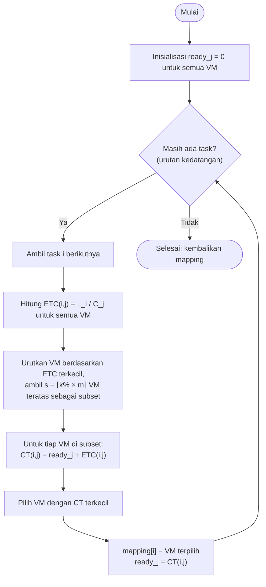
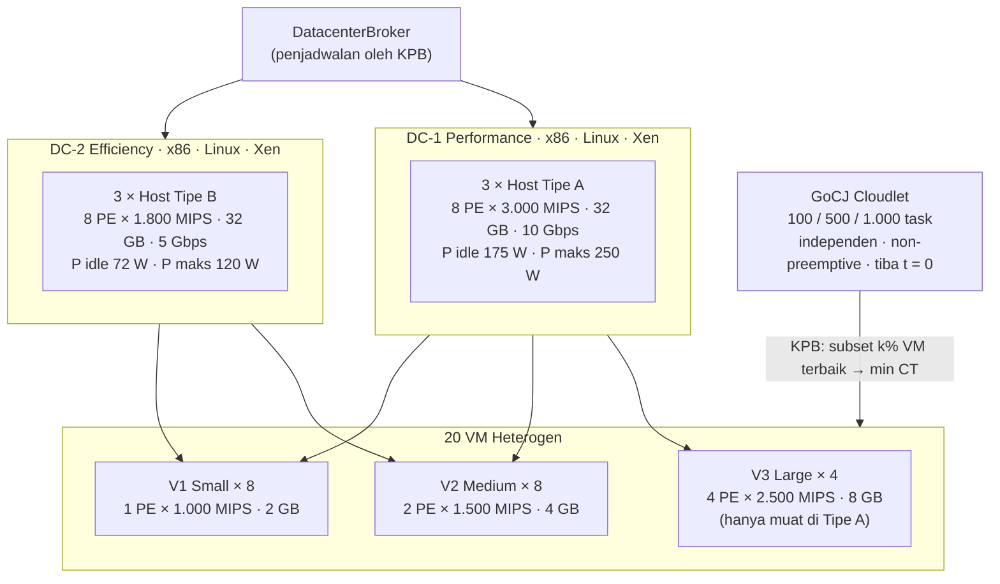

<h1 align="center">KPB Algorithm</h1>
<h2 align="center">Strategi Optimasi Komputasi Awan (SOKA) 2026</h2>
<h3 align="center"><em>Optimasi Penjadwalan Task Menggunakan Algoritma KPB (K-Percent Best)</em></h3>
<h4 align="center">Departemen Teknologi Informasi Institut Teknologi Sepuluh Nopember (ITS)</h4>

<p align="center">
  
  
  
  
  
</p>

---

## Anggota Kelompok 5

| No. | Nama Mahasiswa | NRP | Jobdesk |
| :---: | :--- | :---: | :--- |
| 1 | Naila Cahyarani Idelia | 5027241063 | - |
| 2 | Mey Roslaina | 5027241004 | - |
| 3 | Diva Aulia Rosa | 5027241003 | - |
| 4 | Fika Arka Nuriah | 5027241071 | - |

---

## Daftar Isi

- [1. Pendahuluan](#1-pendahuluan)
- [2. Cara Kerja Algoritma KPB](#2-cara-kerja-algoritma-kpb)
- [3. Arsitektur Datacenter](#3-arsitektur-datacenter)
- [4. Implementasi di Kode](#4-implementasi-di-kode)
- [5. Dataset Uji Coba](#5-dataset-uji-coba)
- [6. Hasil Simulasi](#6-hasil-simulasi)
- [7. Implementasi Real-World](#7-implementasi-real-world)
- [8. Panduan Menjalankan](#8-panduan-menjalankan)
- [9. Struktur Direktori](#9-struktur-direktori)
- [10. Status dan Batasan](#10-status-dan-batasan)
- [11. Referensi](#11-referensi)

---

## 1. Pendahuluan

### 1.1 Latar Belakang

Lingkungan cloud terdiri atas VM dengan kapasitas yang berbeda-beda, sedangkan ukuran task pada dataset GoCJ berkisar antara 15.000 hingga 900.000 MI. Penjadwal harus memutuskan VM mana yang mengerjakan setiap task. Ada dua pendekatan greedy klasik untuk keputusan ini, dan keduanya punya kelemahan:

- **MET (Minimum Execution Time)** selalu memilih VM yang paling cepat mengeksekusi task. Waktu antrean diabaikan, sehingga semua task menumpuk di VM tercepat.
- **MCT (Minimum Completion Time)** memilih VM yang paling cepat *menyelesaikan* task, yaitu waktu antre ditambah waktu eksekusi. Akibatnya task besar bisa dikirim ke VM lambat yang kebetulan sedang kosong.

### 1.2 Solusi: Algoritma KPB

**KPB (K-Percent Best)** adalah heuristik *immediate mode* yang diperkenalkan oleh Maheswaran dkk. (1999). KPB berada di antara MET dan MCT:

> *"Untuk setiap task, batasi pilihan hanya pada k% VM yang paling cocok untuk task itu, lalu di antara kandidat tersebut pilih VM yang paling cepat menyelesaikannya."*

Parameter **k** mengatur perilaku KPB:

```
k = 100/m %  →  hanya 1 kandidat   →  KPB = MET
k = 100 %    →  semua VM kandidat  →  KPB = MCT
1/m < k < 1  →  kompromi: VM lambat tidak dipakai, antrean tetap diperhitungkan
```

Default yang dipakai di project ini adalah **k = 20%**, yaitu 4 dari 20 VM.

> **Perbedaan dengan LJFP.** LJFP mengurutkan task dari yang terpanjang, lalu menjalankan MCT pada **semua** VM. KPB **tidak** mengurutkan task (task diproses sesuai urutan kedatangan) dan hanya mempertimbangkan **subset k% VM terbaik** untuk setiap task.

---

## 2. Cara Kerja Algoritma KPB

### 2.1 Notasi

| Simbol | Arti |
|:---|:---|
| `L_i` | Panjang task *i* (MI) |
| `C_j` | Kapasitas VM *j* (MIPS × PE) |
| `ETC(i,j) = L_i / C_j` | Waktu eksekusi task *i* di VM *j* |
| `ready_j` | Waktu VM *j* selesai mengerjakan antreannya |
| `CT(i,j) = ready_j + ETC(i,j)` | Waktu selesai task *i* bila ditaruh di VM *j* |
| `m` | Jumlah VM (20) |
| `s = ⌈k% × m⌉` | Ukuran subset kandidat (k = 20% → s = 4) |

### 2.2 Langkah Algoritma



1. **Inisialisasi.** Waktu siap (`ready`) semua VM diset 0 karena semua task tiba bersamaan pada t = 0.
2. **Ambil task sesuai urutan kedatangan.** Task tidak diurutkan berdasarkan panjang.
3. **Bentuk subset k% terbaik.** Hitung waktu eksekusi task di setiap VM, urutkan, lalu ambil `s` VM dengan waktu eksekusi terkecil.
4. **Pilih completion time terkecil.** Di antara VM dalam subset, pilih VM dengan `ready + ETC` terkecil.
5. **Commit.** Catat assignment, lalu perbarui `ready` VM terpilih. Ulangi sampai semua task terjadwal.

### 2.3 Pseudocode

```text
KPB(tasks, vms, k):
    s ← max(1, ⌈k/100 × |vms|⌉)
    ready[j] ← 0 untuk setiap VM j
    for task i in tasks (urutan kedatangan):
        subset ← s VM dengan L_i / C_j terkecil
        best   ← argmin_{j ∈ subset} ( ready[j] + L_i / C_j )
        mapping[i] ← best
        ready[best] ← ready[best] + L_i / C_best
    return mapping
```

**Kompleksitas:** O(N · M log M) dengan N = jumlah task dan M = jumlah VM, karena VM diurutkan ulang untuk setiap task. Untuk N = 1.000 dan M = 20, prosesnya selesai dalam hitungan milidetik.

### 2.4 Contoh Perhitungan

Data contoh bawaan program memakai 5 task dan 20 VM dengan k = 20%, sehingga s = 4. Untuk setiap task, keempat VM V3 (10.000 MIPS) selalu menjadi kandidat terbaik.

| Task | Length (MI) | ETC di V3 | `ready` VM0..VM3 sebelum | CT kandidat | VM terpilih |
|:---:|---:|---:|:---:|:---:|:---:|
| 0 | 900.000 | 90 | 0, 0, 0, 0 | 90, 90, 90, 90 | VM0 |
| 1 | 600.000 | 60 | 90, 0, 0, 0 | 150, 60, 60, 60 | VM1 |
| 2 | 450.000 | 45 | 90, 60, 0, 0 | 135, 105, 45, 45 | VM2 |
| 3 | 300.000 | 30 | 90, 60, 45, 0 | 120, 90, 75, 30 | VM3 |
| 4 | 150.000 | 15 | 90, 60, 45, 30 | 105, 75, 60, **45** | VM3 |

Hasilnya `mapping = [0, 1, 2, 3, 3]`, makespan = 90 s, dan rata-rata response = (90 + 60 + 45 + 30 + 45) / 5 = 54 s. Angka ini sama dengan output `mvn -q exec:java`.

### 2.5 Perilaku KPB pada VM yang Konsisten

Pada konfigurasi project ini, VM yang lebih cepat selalu lebih cepat untuk **semua** task, karena `ETC = L / C`. Kondisi ini disebut *consistent ETC*. Akibatnya subset k% terbaik selalu berisi VM yang sama:

| k | Subset (s) | VM yang dipakai |
|:---:|:---:|:---|
| 20% | 4 | Hanya V3 (VM 0–3) |
| 50% | 10 | V3 + 6 VM V2 |
| 100% | 20 | Semua VM (setara MCT) |

Konsekuensinya, makin kecil k, makin sedikit VM yang terpakai. Ini menguntungkan objektif energi karena beban terkonsolidasi di sedikit VM, tetapi makespan bertambah. Dengan kata lain, k berfungsi sebagai tuas *trade-off* antara makespan dan energi yang menjadi fokus desain project ini.

---

## 3. Arsitektur Datacenter

Rancangan target mengikuti Draft Desain Project Kelompok 5: dua datacenter dengan karakter berbeda, satu berorientasi kinerja dan satu berorientasi efisiensi energi.



### 3.1 Spesifikasi Host

| Tipe Host | Jumlah | PE × MIPS | RAM | Bandwidth | P idle | P maks |
|:---|:---:|:---:|:---:|:---:|:---:|:---:|
| A Performance (DC-1) | 3 | 8 × 3.000 | 32 GB | 10 Gbps | 175 W | 250 W |
| B Efficiency (DC-2) | 3 | 8 × 1.800 | 32 GB | 5 Gbps | 72 W | 120 W |
| **Total** | **6** | **48 PE · 115.200 MIPS** | **192 GB** | — | — | — |

Model daya linear: `P(u) = P_idle + (P_maks − P_idle) × u`.

### 3.2 Spesifikasi VM

| Tipe VM | Jumlah | PE × MIPS | Kapasitas (C_j) | RAM | Indeks di kode |
|:---|:---:|:---:|:---:|:---:|:---:|
| V3 Large | 4 | 4 × 2.500 | 10.000 MIPS | 8 GB | VM 0–3 |
| V2 Medium | 8 | 2 × 1.500 | 3.000 MIPS | 4 GB | VM 4–11 |
| V1 Small | 8 | 1 × 1.000 | 1.000 MIPS | 2 GB | VM 12–19 |
| **Total** | **20** | **40 PE** | **72.000 MIPS** | **80 GB** | — |

### 3.3 Batasan Sistem

1. **Exclusive assignment.** Setiap task ditempatkan tepat pada satu VM.
2. **Non-preemptive.** Task yang sudah berjalan tidak dihentikan atau dipindah.
3. **Task independen.** Tidak ada dependensi antar task (*bag of tasks*).
4. **Kompatibilitas MIPS.** V3 (2.500 MIPS/PE) hanya bisa ditempatkan di host Tipe A.
5. **Offline batch.** Semua task tiba pada t = 0 dan diproses sesuai urutan di dataset.

---

## 4. Implementasi di Kode

| File | Peran |
|:---|:---|
| [`KpbScheduler.java`](src/main/java/project/scheduler/KpbScheduler.java) | ★ Algoritma KPB (inti) |
| [`Scheduler.java`](src/main/java/project/scheduler/Scheduler.java) | Antarmuka seragam: `int[] schedule(taskLength, vmCapacity)` |
| [`Experiment.java`](src/main/java/project/Experiment.java) | Entry point: memuat dataset, menjalankan KPB, mencetak metrik |
| [`GoCJLoader.java`](src/main/java/project/data/GoCJLoader.java) | Membaca file GoCJ (satu nilai MI per baris) |
| [`EtcMatrix.java`](src/main/java/project/model/EtcMatrix.java) | Matriks `ETC[i][j] = L_i / C_j` |
| [`FitnessEvaluator.java`](src/main/java/project/model/FitnessEvaluator.java) | Menghitung makespan dan beban per VM dari mapping |
| [`MetricsCollector.java`](src/main/java/project/metrics/MetricsCollector.java) | Menghitung makespan, rata-rata response time, dan throughput |
| [`EnergyMeter.java`](src/main/java/project/metrics/EnergyMeter.java) | Estimasi energi dengan model daya linear (belum dipanggil) |
| [`setup/`](src/main/java/project/setup/) | Kerangka factory CloudSim Plus (belum dipakai runner) |

Pemetaan langkah algoritma ke kode di `KpbScheduler.schedule()`:

| Langkah | Kode |
|:---|:---|
| 1. Task diproses sesuai urutan kedatangan | `for (int task = 0; task < taskLength.length; task++)` |
| 2. Ranking VM berdasarkan ETC | `rankByExecutionTime(taskLength[task], vmCapacity)` |
| 3. Ambil subset k% | `for (int c = 0; c < subsetSize; c++)` dengan `subsetSize = ⌈k% × m⌉` |
| 4. Pilih min completion time | `finish = readyTime[vm] + taskLength[task] / vmCapacity[vm]` |
| 5. Commit dan update ready time | `mapping[task] = selectedVm; readyTime[selectedVm] = bestFinish;` |

---

## 5. Dataset Uji Coba

| Aspek | Keterangan |
|:---|:---|
| Nama | GoCJ (Google Cloud Jobs) Dataset |
| Sumber | Mendeley Data, diturunkan dari jejak beban kerja Google cluster |
| Format | Teks, satu panjang task (MI) per baris |
| Rentang | 15.000 – 900.000 MI |
| File | `GoCJ_Dataset_100.txt`, `GoCJ_Dataset_500.txt`, `GoCJ_Dataset_1000.txt` |

| Skenario | Jumlah task | Tujuan |
|:---:|:---:|:---|
| S1 | 100 | Verifikasi kebenaran implementasi |
| S2 | 500 | Beban normal (skenario acuan utama) |
| S3 | 1.000 | Uji skalabilitas |

Pemetaan ke cloudlet: `length` diambil dari GoCJ, `numberOfPes = 1`, `fileSize = outputSize = 300 KB`, dan semua task tiba pada t = 0.

---

## 6. Hasil Simulasi

> Hasil di bawah berasal dari **model evaluasi analitik** (`FitnessEvaluator`), belum dari simulasi CloudSim penuh. Response time = waktu selesai task (antrean + eksekusi), karena semua task tiba pada t = 0.

### 6.1 Pengaruh Parameter k

| Skenario | k | Makespan (s) | Avg Response (s) | Throughput (task/s) |
|:---:|:---:|---:|---:|---:|
| S1 (100) | 20% | 362,450 | 161,417 | 0,276 |
| S1 (100) | 50% | 270,950 | 110,719 | 0,369 |
| S1 (100) | 100% | 230,900 | 89,963 | 0,433 |
| S2 (500) | 20% | 1.630,750 | 814,034 | 0,307 |
| S2 (500) | 50% | 1.134,700 | 560,633 | 0,441 |
| S2 (500) | 100% | 925,400 | 449,936 | 0,540 |
| S3 (1.000) | 20% | 3.278,250 | 1.576,517 | 0,305 |
| S3 (1.000) | 50% | 2.288,000 | 1.087,213 | 0,437 |
| S3 (1.000) | 100% | 1.866,350 | 875,315 | 0,536 |

### 6.2 Analisis Sementara

1. **Makespan turun ketika k naik.** Subset yang lebih besar memberi KPB lebih banyak VM untuk menyebar beban. Pada k = 100%, KPB identik dengan MCT.
2. **k = 20% hanya memakai 4 VM V3.** Karena ETC konsisten, 16 VM lain tidak pernah menerima task. Konsolidasi seperti ini berpotensi menghemat energi, tetapi pembuktiannya menunggu `EnergyMeter` dan simulasi CloudSim.
3. **Throughput hampir konstan antar skenario** untuk k yang sama. Ini menunjukkan perilaku KPB stabil terhadap jumlah task.
4. Hasil ini **belum** dibandingkan dengan Round Robin, Min-Min, dan PSO, sehingga belum bisa diklaim sebagai algoritma terbaik.

---

## 7. Implementasi Real-World

> **Belum diimplementasikan.** Rencananya mengikuti poin 5–6 catatan tugas: KPB dijalankan di lingkungan nyata, misalnya container Docker dengan batas CPU berbeda sebagai proksi V1/V2/V3, memakai dataset GoCJ yang sama.

---

## 8. Panduan Menjalankan

### Prasyarat

| Software | Versi | Cek |
|:---|:---:|:---|
| Java JDK | 11+ | `java -version` |
| Maven | 3.8+ | `mvn -version` |

### Build

```bash
mvn -q clean compile
```

### Menjalankan

Format argumen: `<path_dataset> [k_persen]`. Bila `k` tidak diberikan, default 20%.

```bash
# Data contoh 5 task (sesuai contoh perhitungan di bagian 2.4)
mvn -q exec:java

# S1: 100 task, k = 20%
mvn -q exec:java -Dexec.args="src/main/resources/dataset/GoCJ_Dataset_100.txt"

# S2: 500 task, k = 50%
mvn -q exec:java -Dexec.args="src/main/resources/dataset/GoCJ_Dataset_500.txt 50"

# S3: 1.000 task, k = 100% (setara MCT)
mvn -q exec:java -Dexec.args="src/main/resources/dataset/GoCJ_Dataset_1000.txt 100"
```

Menyimpan output dan melihat ringkasannya:

```bash
mvn -q exec:java -Dexec.args="src/main/resources/dataset/GoCJ_Dataset_1000.txt" > hasil_s3.txt
grep -E '^(scheduler|tasks=|vmLoads=)' hasil_s3.txt
```

### Membaca Output

```text
scheduler=KPB(k=20.0%)
tasks=1000, makespan=3278.250, avgResponse=1576.517, throughput=0.305
mapping=[...]
vmLoads=[...]
```

- `scheduler`: algoritma beserta nilai k.
- `tasks`: jumlah task yang dibaca dari dataset.
- `makespan`: waktu selesai task terakhir (detik).
- `avgResponse`: rata-rata waktu selesai task, termasuk antrean (detik).
- `throughput`: `tasks / makespan`.
- `mapping[i]`: indeks VM untuk task ke-i (lihat tabel 3.2).
- `vmLoads[j]`: total waktu kerja VM ke-j. Nilai 0 berarti VM tidak terpakai.

### Validasi Dataset

```bash
for f in src/main/resources/dataset/GoCJ_Dataset_*.txt; do
  awk 'NF { n++; if ($1 < 15000 || $1 > 900000) bad++ }
       END { print FILENAME, "records=" n, "invalid=" (bad + 0) }' "$f"
done
```

---

## 9. Struktur Direktori

```
soka-a-5/
├── README.md
├── pom.xml                              ← Maven + CloudSim Plus 6.6.1
└── src/main/
    ├── java/project/
    │   ├── Experiment.java              ← Entry point
    │   ├── scheduler/
    │   │   ├── Scheduler.java           ← Antarmuka scheduler
    │   │   └── KpbScheduler.java        ← ★ Algoritma KPB (inti)
    │   ├── data/
    │   │   └── GoCJLoader.java          ← Loader dataset GoCJ
    │   ├── model/
    │   │   ├── EtcMatrix.java           ← Matriks ETC
    │   │   └── FitnessEvaluator.java    ← Makespan & beban VM
    │   ├── metrics/
    │   │   ├── MetricsCollector.java    ← Makespan, response, throughput
    │   │   ├── EnergyMeter.java         ← Estimasi energi (kWh)
    │   │   └── Result.java
    │   └── setup/                       ← Kerangka CloudSim Plus
    │       ├── DatacenterFactory.java
    │       ├── VmFactory.java
    │       ├── SimulationSetup.java
    │       └── CloudSimAdapter.java
    └── resources/dataset/
        ├── GoCJ_Dataset_100.txt
        ├── GoCJ_Dataset_500.txt
        ├── GoCJ_Dataset_1000.txt
        └── dataset.txt                  ← 5 task contoh
```

---

## 10. Status dan Batasan

| Tugas | Status |
|:---|:---|
| 1. Slide langkah algoritma | Materi tersedia di bagian 2 |
| 2. Datacenter di simulator sesuai desain | ⚠️ Kerangka ada; `DatacenterFactory`/`VmFactory` belum sesuai spesifikasi 2 DC dan belum dijalankan |
| 3. Implementasi KPB di simulator | ✅ Scheduler KPB + evaluasi analitik |
| 4. Ujicoba dataset minggu 3 (S1–S3) | ✅ Analitik · ⚠️ belum via CloudSim |
| 5. Implementasi KPB di real world | ❌ Belum |
| 6. Ujicoba real world | ❌ Belum |

Asumsi dan batasan model analitik saat ini:

- Kapasitas VM dihitung sebagai `MIPS × PE` (sesuai rumus makespan di desain), padahal setiap cloudlet memakai 1 PE. Di CloudSim, task 1-PE pada V3 berjalan di 2.500 MIPS, bukan 10.000.
- Energi, utilisasi host, degree of imbalance, biaya, waktu komputasi algoritma, dan ekspor CSV belum dihitung oleh runner.
- Belum ada pengulangan 10 run dan belum ada baseline Round Robin, Min-Min, dan PSO.

---

## 11. Referensi

1. Maheswaran M, Ali S, Siegel HJ, Hensgen D, Freund RF. Dynamic matching and scheduling of a class of independent tasks onto heterogeneous computing systems. *Proc. 8th Heterogeneous Computing Workshop (HCW '99)*. 1999:30–44.
2. Braun TD, et al. A comparison of eleven static heuristics for mapping a class of independent tasks onto heterogeneous distributed computing systems. *Journal of Parallel and Distributed Computing*. 2001;61(6):810–837.
3. Silva Filho MC, et al. CloudSim Plus: A modern Java 8 framework for modeling and simulation of cloud computing infrastructures. *IFIP/IEEE IM*. 2017.
4. Hussain A, Aleem M. GoCJ: Google Cloud Jobs Dataset for Distributed and Cloud Computing Infrastructures. *Data*. 2018;3(4):38. Mendeley Data.

---

<p align="center">
  <b>Kelompok 5 Strategi Optimasi Komputasi Awan (SOKA)</b><br>
  Departemen Teknologi Informasi, Institut Teknologi Sepuluh Nopember (ITS)<br>
  Surabaya, Indonesia 2026
</p>
